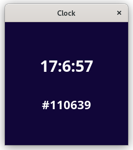

# guile-webview

Wrapper for using libwebview from GNU Guile 

### Dependencies
- gtk+-3.0 
- webkit2gtk-4.0
- [bytestructures](https://github.com/TaylanUB/scheme-bytestructures)
- [ffi-help-rt](https://git.savannah.nongnu.org/cgit/nyacc.git/tree/module/system/ffi-help-rt.scm)

### Build
```sh
g++ ./webview/webview.cc -fPIC -shared -DWEBVIEW_BUILD_SHARED -DWEBVIEW_GTK -std=c++11 $(pkg-config --cflags --libs gtk+-3.0 webkit2gtk-4.0) -o libwebview.so
```

### Install
Copy `libwebview.so` to your shared libraries path, and `webview.scm` to you guile `(%site-dir)` path

### Run example
```sh
LTDL_LIBRARY_PATH=. guile3.0 ./examples/clock.scm
```

### Example
Example of use with [GuileScript](https://github.com/aconchillo/guilescript) and [htmlprag](https://www.nongnu.org/guile-lib/doc/ref/htmlprag/)



```scheme
(use-modules (webview)
	     (htmlprag)
	     (ice-9 receive)
	     ((language guilescript compile) #:prefix gs:))

(define js-script
  (receive (js _)
      (gs:compile
       '(begin
	  (define (calcloop)
	    (let ((date (js-new Date))
		  (hour (js-invoke date getHours))
		  (min  (js-invoke date getMinutes))
		  (sec  (js-invoke date getSeconds))
		  (toHex (lambda (d)
			   (define hex (js-invoke (js-invoke (+ "0" (js-invoke (Number d) toString 16)) slice -2) toUpperCase))
			   hex))
		  (hex (+ "#" (toHex hour) (toHex min) (toHex sec))))
	      (js-set! (js-invoke document getElementById "clock") innerHTML (+ hour ":" min ":" sec))
	      (js-set! (js-invoke document getElementById "clock-hex") innerHTML hex)
	      (js-set! document.body.style background hex)))
	  (js-set! window onload (lambda ()
				   (setInterval calcloop 1000)))))
    js))


(define page-html
  (sxml->html `(body (@ (style "display:flex; flex-direction:column; justify-content:center; align-items:center"))
		     (h1 (@ (id "clock")
			     (style "color: #fff")) "")
		     (h2 (@ (id "clock-hex")
			     (style "color: #fff")) "")
		     (script ,js-script))))

(define wv (webview-create 1 (make-webview-t)))
(webview-set-title wv "Clock")
(webview-set-html wv page-html)
(webview-set-size wv 250 250 0)
(webview-run wv)
```

### Tested on
```
GNU Guile 3.0.7
```
